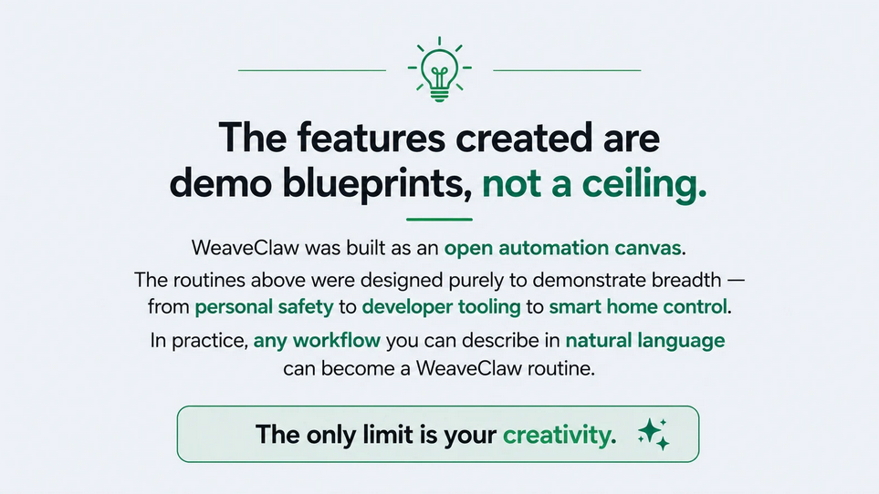

<p align="center">
  
  
  
  
</p>

<h1 align="center">🕸️ WeaveClaw</h1>
<p align="center"><b>Ditch the coding scenes. Just automate your routines.</b></p>
<p align="center">
  A conversational AI automation engine built on top of the <a href="https://github.com/nicepkg/openclaw">OpenClaw</a> ecosystem that turns <i>natural language</i> into powerful, privacy-first on-device automations — no coding, no companion apps, no cloud.
</p>

---

## Evaluation Resources

- **Project Demo Video:** A concise walkthrough (7 minutes) demonstrating the problem, core features, and an end-to-end usage scenario. Link: [Demo Video](#).

- **AI Disclosure:** A brief statement describing which AI models and tools were used, how they were applied, and any data or privacy considerations (e.g., on-device vs. cloud processing). Link: [AI Disclosure](https://docs.google.com/document/d/1i6jxCZyWI92Y--x9PeE7rigNWJlKA1dhdSSAykXcb1A/edit?tab=t.0).

- **Project Presentation (PPT):** Slide deck (PPTX) summarizing the problem, solution, architecture, demo highlights, and usage / deployment notes. Link: [Project Presentation (PPT)](https://canva.link/o31ar7ky0h0vwbz).

<!-- ═══════════════════════════════════════════════════════ -->

## 📌 Table of Contents

- [Problem](#-problem)
- [Solution](#-solution)
- [Key Features](#-key-features)
- [Architecture](#-architecture)
- [Tech Stack](#-tech-stack)
- [Project Structure](#-project-structure)
- [Setup & Installation](#-setup--installation)
- [Usage](#-usage)
- [Samsung Ecosystem Fit](#-samsung-ecosystem-fit)
- [Team](#-team)
- [License](#-license)

---

## ❗ Problem

The OpenClaw platform gives developers the raw power to bridge code and the real world — from controlling smart lights on a GitHub push to launching complex multi-app workflows. **But there's a catch:**

| Barrier                                                        | Impact                                              |
| -------------------------------------------------------------- | --------------------------------------------------- |
| **Requires YAML, bash, and Android intents**                   | 95 %+ of users can't build automations              |
| **No conversational interface**                                | Every routine must be hand-coded end-to-end         |
| **Cloud-dependent alternatives** (Alexa, Google Home, Copilot) | Every voice command & data packet leaves the device |
| **Bixby's rigid menu-driven setup**                            | Frustrating UX, limited composability               |

> _The use case is there. The tool is there. But the bridge between the two is broken._

---

## 💡 Solution

**WeaveClaw is the intelligence layer that automates the _creation_ of ANY use case.**

Instead of building one highly specific automation, we built an engine that lets _any user_ — technical or not — describe what they want in plain language (via Telegram, or any chat app), and have the system:

1. **Parse intent** using a locally-running **Qwen3-Coder-30B LLM** (quantized, fully on-device).
2. **Translate** that intent into structured command chains — routines, deep links, shell commands, visual agent actions.
3. **Execute** those commands directly on the Samsung Galaxy device in real-time via **Termux**, controlling apps, system settings, smart home devices, and even physically navigating UIs.
4. **Learn & suggest** — a heartbeat-driven pattern scanner detects repeated behaviors and suggests new automations automatically.

**Zero cloud. Zero coding. Zero companion apps.**

---

## ✨ Key Features

<p align="center">
  
</p>

---

### 1. 🔄 Routine Automation Engine
Define keyword-triggered routines entirely through chat. Say _"Lock In"_ and WeaveClaw instantly:
- Enables DND
- Launches LoFi music on YouTube Music
- Sets smart lights to Cyan
- All in under 3 seconds

Routines are stored in `routines.json` and can be created, edited, and deleted conversationally — the bot dynamically rewrites the JSON on the fly.

### 2. 🛡️ Safe Journey (Personal Safety)
A critical tool for the safety of women and the elderly:
- User types their destination and ETA
- System sends SMS + live location to all emergency contacts via Telegram
- Auto-sets a `Y+10 minute` check-in timer
- If the user doesn't confirm arrival → proactive alert to all contacts
- If confirmed → contacts get a safe-arrival notification

### 3. 🗺️ Trip Planner (Complex Multi-App Flows)
WeaveClaw bridges separate apps into a single cohesive workflow:
- Proactively reads calendar for events
- Web-searches weather at the destination
- Finds top-rated restaurants & activities
- Physically navigates the Notes app to save a complete itinerary
- All through the **Visual Agent** when deep links aren't enough

### 4. 👁️ Visual Agent (Qwen-Powered Screen Automation)
When intents or deep links can't reach a target, the Visual Agent takes over:
- Captures the screen's UI hierarchy via `uiautomator`
- Reads bounding-box coordinates of every element
- The LLM outputs precise tap/swipe/type JSON actions
- Operates autonomously for up to 15 steps per task

### 5. 🔔 GitHub Repository Watcher
Background polling for pushes, issues, PRs, and releases on any GitHub repo:
- Supports private repos with token auth
- Sends real-time Telegram notifications
- Physical smart light feedback (red = new push detected, blink = auto-fix running, green = done)

### 6. 🔒 100% On-Device Privacy
While Alexa, Google Home, and Microsoft Copilot send every word to the cloud, WeaveClaw stays silent:
- **Qwen3-Coder-30B** runs locally via Ollama
- Shell execution happens on-device
- No external API calls for processing
- Enterprise-ready — aligns with Samsung Knox security policies

---

## 🏗️ Architecture

```
┌──────────────────────────────────────────────────────────────┐
│                        USER                                  │
│              (Telegram / Any Chat App)                       │
└──────────────────┬───────────────────────────────────────────┘
                   │ Natural Language Message
                   ▼
┌──────────────────────────────────────────────────────────────┐
│                  WeaveClaw Backend (Node.js)                 │
│  ┌──────────────┐  ┌───────────────┐  ┌──────────────────┐  │
│  │Rule Classifier│→│ Skill Builder │→│ Skill Executor    │  │
│  │(NLP / Intent) │  │(Action Plan)  │  │(Command Dispatch)│  │
│  └──────────────┘  └───────────────┘  └────────┬─────────┘  │
│  ┌──────────────┐  ┌───────────────┐           │            │
│  │Clarification │  │ Heartbeat /   │           │            │
│  │Handler       │  │ Pattern Scan  │           │            │
│  └──────────────┘  └───────────────┘           │            │
│  ┌──────────────┐  ┌───────────────┐           │            │
│  │Watcher Runner│  │ Notifications │           │            │
│  │(GitHub Poll) │  │ (WebSocket)   │           │            │
│  └──────────────┘  └───────────────┘           │            │
└────────────────────────────────────────────────┼────────────┘
                                                 │
              ┌──────────────────────────────────┤
              ▼                                  ▼
┌─────────────────────────┐    ┌──────────────────────────────┐
│   OpenClaw / ADB Layer  │    │   Qwen3-Coder-30B (Ollama)   │
│  ┌────────────────────┐ │    │   Local LLM for:             │
│  │ phone_control.sh   │ │    │   - Intent parsing           │
│  │ phone_agent.sh     │ │    │   - Visual agent reasoning   │
│  │ routine_runner.sh  │ │    │   - Routine generation       │
│  └────────┬───────────┘ │    └──────────────────────────────┘
│           │             │
│  ┌────────▼───────────┐ │
│  │ Termux + Shizuku   │ │
│  │ (ADB Shell Access) │ │
│  └────────┬───────────┘ │
└───────────┼─────────────┘
            ▼
┌─────────────────────────┐
│   Samsung Galaxy Device │
│  • Apps  • System       │
│  • Smart Lights (IoT)   │
│  • Calendar / Notes     │
│  • Telegram             │
└─────────────────────────┘
```

---

## 🛠️ Tech Stack

| Layer               | Technology                                                    |
| ------------------- | ------------------------------------------------------------- |
| **On-Device LLM**   | Qwen3-Coder-30B (quantized), served via Ollama                |
| **Backend**         | Node.js, Express 5, SQLite (better-sqlite3), WebSocket (ws)   |
| **Mobile App**      | Flutter (Dart), Material 3                                    |
| **Shell Execution** | Bash scripts on Termux      |
| **Smart Home**      | MR Star LED controller, Wipro RGBCCT bulb (via UI automation) |
| **Messaging**       | Telegram Bot API, deep links (`tg://resolve`)                 |
| **Background Jobs** | node-cron (heartbeat), custom watcher runner (GitHub polling) |
| **Validation**      | Zod schemas, Jest + Supertest (7 test suites)                 |
| **Version Control** | Git, GitHub                                                   |

---

## 📁 Project Structure

```
WeaveClaw/
├── backend/                        # Node.js backend server
│   ├── src/
│   │   ├── index.js                # Express app entry, WebSocket, cron setup
│   │   ├── api/
│   │   │   ├── chat.js             # POST /chat — conversational AI endpoint
│   │   │   ├── skills.js           # CRUD + execute for skills
│   │   │   ├── devices.js          # Device registry
│   │   │   ├── watchers.js         # GitHub watcher CRUD
│   │   │   ├── conflicts.js        # Skill conflict detection
│   │   │   ├── suggestions.js      # AI-generated suggestions
│   │   │   └── webhooks.js         # Incoming webhook handler
│   │   ├── services/
│   │   │   ├── nlp/                # Rule classifier, skill builder, clarification
│   │   │   ├── skills/             # Executor, scheduler, conflict detector, validators
│   │   │   ├── integrations/       # ADB bridge, OpenClaw adapter, SmartThings, simulation
│   │   │   ├── watchers/           # Background GitHub commit poller
│   │   │   ├── heartbeat/          # Pattern scanner for auto-suggestions
│   │   │   └── notifications/      # WebSocket + push notification delivery
│   │   └── db/
│   │       ├── db.js               # SQLite connection
│   │       └── schema.sql          # Full database schema (6 tables)
│   ├── scripts/                    # DB migration & seed scripts
│   ├── tests/                      # 7 test suites (Jest + Supertest)
│   ├── .env.example                # Environment template
│   └── package.json
│
├── flutter_app/                    # Cross-platform companion UI
│   └── lib/
│       ├── main.dart               # App shell with bottom navigation
│       ├── screens/
│       │   ├── chat_screen.dart    # Conversational chat interface
│       │   ├── skill_library_screen.dart
│       │   ├── suggestions_screen.dart
│       │   └── community_hub_screen.dart
│       ├── services/               # API client + chat persistence
│       ├── models/                 # Skill, Suggestion, ChatMessage models
│       └── widgets/                # SkillCard, SuggestionCard, ConflictCard
│
├── openclaw-skill/                 # OpenClaw skill definitions
│   ├── SKILL.md                    # Master engine protocol (TDSL)
│   ├── HEARTBEAT.md                # Heartbeat checklist
│   ├── github-skill.md             # GitHub watch-and-fix skill
│   ├── journey-watch.md            # Safe Journey safety skill
│   └── travel-planning.md          # Trip Planner skill
│
├── openclaw-tools/                 # Standalone shell tools
│   ├── github_repo_watcher.sh      # Background GitHub poller
│   ├── github_repo_notify_telegram.sh  # Telegram alert hook
│   └── github_repo_watcher.md      # Documentation
│
├── assets/
│   └── features-canvas.png         # Key Features banner image
├── phone_control.txt               # 970+ line device control script (phone_control.sh)
├── phone_agent.txt                 # Visual agent script (phone_agent.sh)
├── routine_runner.txt              # Routine execution engine (routine_runner.sh)
├── routines.json                   # Pre-configured routine definitions
├── Agent.md.txt                    # AGENTS.md context file for LLM
└── WeaveClaw — Full Demo Video Script.md
```

---

## ⚙️ Setup & Installation

### Prerequisites

| Requirement              | Details                                                                             |
| ------------------------ | ----------------------------------------------------------------------------------- |
| **Samsung Galaxy phone** | (or any Android device with Termux support)                                         |
| **Termux**               | Terminal emulator for Android — [F-Droid](https://f-droid.org/packages/com.termux/) |
| **Ollama**               | Local LLM server (for Qwen3-Coder-30B)                                              |
| **Node.js**              | v18+ (for backend)                                                                  |
| **Flutter**              | 3.11+ (for mobile app)                                                              |
| **jq**                   | JSON processor (`pkg install jq` in Termux)                                         |
| **curl**                 | HTTP client (`pkg install curl` in Termux)                                          |

### 1. Clone the Repository

```bash
git clone https://github.com/RahulRR-10/WeaveClaw.git
cd WeaveClaw
```

### 2. Backend Setup

```bash
cd backend

# Copy environment template and fill in your values
cp .env.example .env

# Install dependencies
npm install

# Seed the database with demo data (optional)
npm run seed

# Start the development server
npm run dev
```

The backend will start on `http://localhost:3000`.

#### Environment Variables

| Variable                          | Required | Description                                          |
| --------------------------------- | -------- | ---------------------------------------------------- |
| `PORT`                            | No       | Server port (default: `3000`)                        |
| `DB_PATH`                         | No       | SQLite database path (default: `./WeaveClaw.db`)     |
| `SIMULATION_MODE`                 | No       | `true` to simulate device commands                   |
| `OPENCLAW_GATEWAY_URL`            | Yes      | OpenClaw gateway (default: `http://localhost:18789`) |
| `OPENCLAW_AUTH_TOKEN`             | Yes      | Auth token after OpenClaw onboarding                 |
| `SMARTTHINGS_TOKEN`               | No       | Samsung SmartThings API token                        |
| `HEARTBEAT_INTERVAL_MINUTES`      | No       | Pattern scan frequency (default: `15`)               |
| `SUGGESTION_CONFIDENCE_THRESHOLD` | No       | Min confidence for suggestions (default: `0.70`)     |

### 3. Flutter App Setup

```bash
cd flutter_app

# Get dependencies
flutter pub get

# Run on connected device or emulator
flutter run
```

### 4. On-Device Shell Scripts (Termux)

Deploy the core scripts to your Android device:

```bash
# Install phone_control.sh
# (Run the contents of phone_control.txt in Termux — it self-installs to ~/phone_control.sh)

# Install phone_agent.sh
# (Run the contents of phone_agent.txt in Termux — it self-installs to ~/phone_agent.sh)

# Install routine_runner.sh
# (Run the contents of routine_runner.txt in Termux — it self-installs to ~/routine_runner.sh)

# Copy routines to the OpenClaw workspace
mkdir -p ~/.openclaw
cp routines.json ~/.openclaw/routines.json

# Install the AGENTS.md context file
mkdir -p ~/.openclaw/workspace
# (Run the contents of Agent.md.txt in Termux — it self-installs AGENTS.md)
```

### 5. Local LLM Setup

```bash
# Install Ollama (see https://ollama.ai)
# Pull the Qwen model
ollama pull qwen3-coder:30b

# Ollama serves on http://localhost:11434 by default
```

---

## 🚀 Usage

### Talking to WeaveClaw

WeaveClaw lives in your chat app. Send a natural language message to the bot:

```
User: "Lock In"
→ WeaveClaw enables DND, plays LoFi music, sets lights to Cyan

User: "I'm heading to MG Road, should reach in 20 mins"
→ WeaveClaw sends location + ETA to emergency contacts, sets check-in timer

User: "Plan a trip to Church Street this Saturday"
→ WeaveClaw checks calendar, weather, finds restaurants, saves itinerary to Notes
```

### API Endpoints

| Endpoint              | Method          | Description                                                          |
| --------------------- | --------------- | -------------------------------------------------------------------- |
| `/chat`               | POST            | Conversational AI — intent classification, skill creation, execution |
| `/skills`             | GET             | List all skills                                                      |
| `/skills/:id/execute` | POST            | Execute a specific skill                                             |
| `/devices`            | GET             | List registered devices                                              |
| `/watchers`           | GET/POST/DELETE | Manage background watchers                                           |
| `/suggestions`        | GET             | View AI-generated suggestions                                        |
| `/conflicts`          | GET             | Detect skill conflicts                                               |
| `/heartbeat/scan`     | POST            | Trigger a pattern scan                                               |
| `/health`             | GET             | Health check                                                         |
| `/ws`                 | WebSocket       | Real-time notifications                                              |

### Running Routines Directly

```bash
# No variables
bash ~/routine_runner.sh gym-mode

# With variables
bash ~/routine_runner.sh search-youtube --QUERY "lofi hip hop"
bash ~/routine_runner.sh set-reminder --TASK "buy milk" --TIME "5pm"
```

### GitHub Watcher

```bash
# One-time check
bash github_repo_watcher.sh --repo RahulRR-10/WeaveClaw --watch all --once

# Continuous background polling with Telegram notifications
nohup bash github_repo_watcher.sh \
  --repo RahulRR-10/WeaveClaw \
  --watch all \
  --interval 300 \
  --notify-cmd 'github_repo_notify_telegram.sh' &
```

### Phone Control Examples

```bash
# Open an app
bash ~/phone_control.sh open-app com.whatsapp

# Toggle DND
bash ~/phone_control.sh dnd

# Send a Telegram message
bash ~/phone_control.sh telegram JohnDoe "Hello from WeaveClaw!"

# Set smart lights to cyan
bash ~/phone_control.sh lights color cyan

# Check calendar
bash ~/phone_control.sh calendar tomorrow

# Create a note
bash ~/phone_control.sh notes create "Shopping List" "Milk, Eggs, Bread"

# Trigger the Visual Agent
bash ~/phone_agent.sh "Open YouTube and search for productivity music"
```

---

## 📱 Samsung Ecosystem Fit

WeaveClaw is purpose-built for the Samsung ecosystem:

| Samsung Platform | WeaveClaw Integration                                           |
| ---------------- | --------------------------------------------------------------- |
| **Bixby**        | Replaces rigid menu-driven setup with fluid, conversational AI  |
| **Knox**         | Data never leaves the device — fully local LLM processing       |
| **SmartThings**  | Native command translation for home automation                  |
| **Samsung DeX**  | Plug in, type a message, and have your workspace auto-configure |
| **Galaxy AI**    | Extends on-device AI with autonomous multi-step workflows       |

---

<p align="center">
  <i>"Without AI, your phone is just a dabba."</i><br/>
  <b>WeaveClaw — Ditch the coding scenes. Just automate your routines.</b>
</p>
